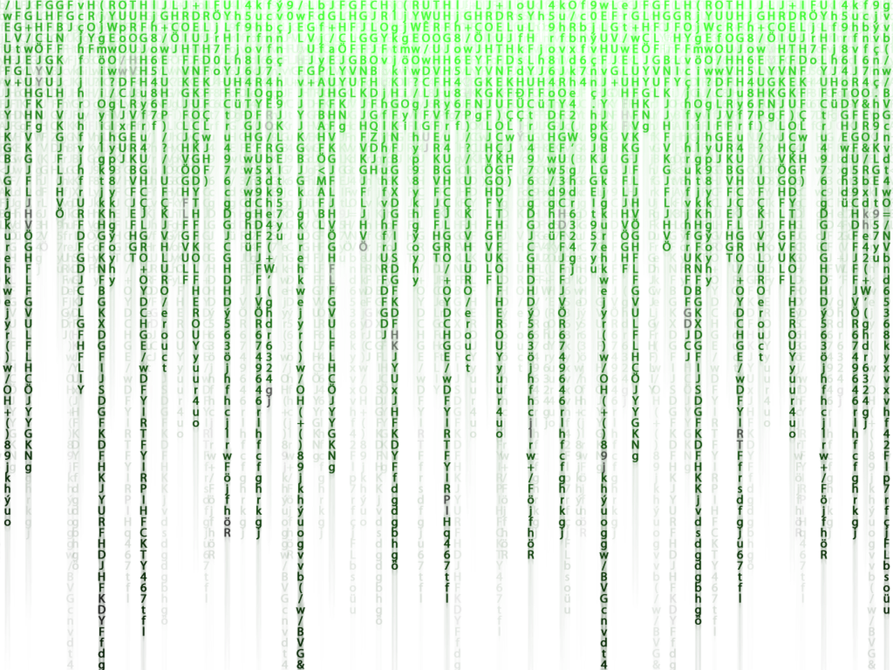

# Welcome to my Home Page!

## About me
My favorite programming language is Python.
That's all I got.

## The Matrix
I wonder if people in **The Matrix** actually coded before...

This picture is ~~not~~ from **The Matrix**.



In the words of *Morpheus*:
> What you know you can't explain, but you feel it. You've felt it your entire life.

I feel like *Morpheus* would be the type to type the command `del -f System32` so he could ***break*** the simulation.

DON'T TYPE THAT IN THAT WOULD BE BAD!

## HappyPlace
Something you could type in is:
```
mkdir HappyPlace
cd HappyPlace
```

You'd then be in a folder called HappyPlace...
and hopefully you'd be happy...
because it's your HappyPlace.

Currently, [this](HappyPlace.md) is my HappyPlace.

There's this guy I know of who has a personal website like this one.
His is way cooler. Hopefully one day mine looks like [this](https://bod.ge).

## Bucket List
Speaking of one day, one day I want to do this stuff.
1. Drive a car on the Nurburgring
    - I would be ok with the Autobahn too
2. Jump out of a plane
    - With a parachute
3. Finish making my Bucket List
    - Not quite done yet

In order to finish those things I have to do the following:
- [ ] Finish this class
- [ ] Graduate college
- [x] Get a job
- [ ] Save up enough money
- [ ] Find time

This list was supposed to be empty, but I guess I'm ahead of the game.
I don't why am I still here
Hope this was funny :P
